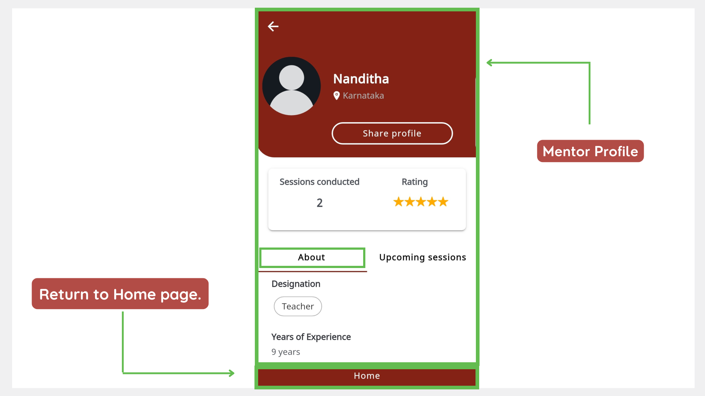

import PartialExample from './_mentored.mdx';

# Using a Shared Link to View a Mentor Profile

A Mentor Profile helps mentors and mentees perform the following actions:

* View details about the mentor.
* View the ratings they received for sessions.
* Discover sessions created by the mentor.
* Enroll and join for sessions.

You can view a mentor profile using a link shared by your contacts or on social media.

> :::tip 
> Users who have not registered on <PartialExample mentored /> yet, should do the following actions:
>
> 1. Install the application.
>
> 2. Sign up.
>
> 3. Update your profile before enrolling and joining for sessions created by the mentor.

1.	Tap the Shared link.

    

2.	Tap **<PartialExample mentored />** to view the Mentor Profile page.

    

> :::info
> To learn more about viewing the profile of other mentors, see [Mentor Directory](mentor-directory.md).
>
> To learn more about enrolling and joining for sessions created by the mentor, see the following topics:
> * [Enrolling for a Session](enrolling-for-a-session.md)
> * [Joining a Session](joining-a-session.md)
