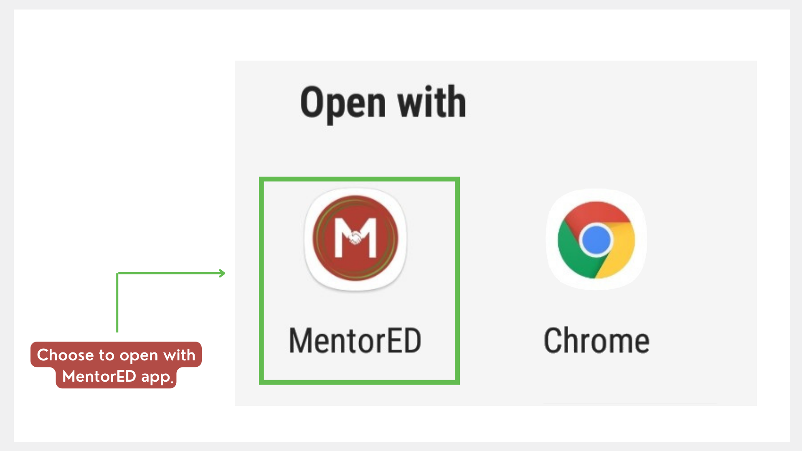

import PartialExample from './_mentored.mdx';

# Using a Shared Link to Join a Session

You can join mentoring sessions using a link shared by your contacts or on social media.

> :::tip 
> Users who have not registered on <PartialExample mentored /> yet, should do the following actions:
>
> 1. Install the application.
>
> 2. Sign up.
>
> 3. Update your profile.
>
> 4. Enroll for sessions.

**To join a session using a shared link, do as follows:**

1. Tap the shared link and tap **<PartialExample mentored />**. 

   
   
2. Tap **Join**. The BigBlueButton meeting window appears on your web browser. 

   >:::note
   >If you haven't enrolled for the session yet, tap **Enroll**.

   

> :::info 
> * To know more about enrolling for a session and cancelling your enrollment, see [Enrolling for a Session](enrolling-for-a-session.md). 
> * To know more about joining a BigBlueButton meeting, see [Configuring the BigBlueButton Settings](joining-a-session.md).

  
   
