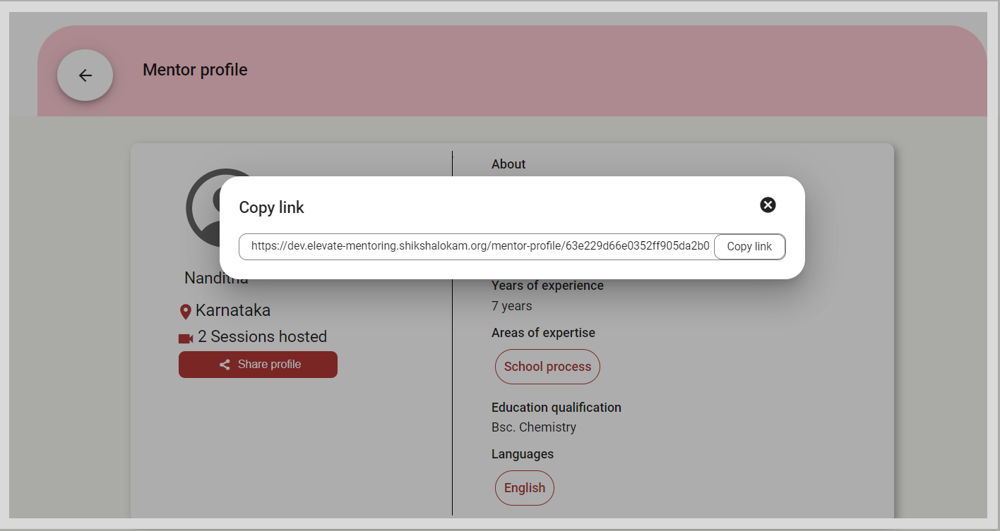

import PartialExample from './_mentored.mdx';
import MentorDirectoryIcon from './media/mentordirectory-icon.png';
import MentorProfilePage from './media/mentorprofile.PNG'
import SearchMentor from './media/searchmentordirectory.PNG'
import UpcomingSession from './media/mentordirectory-upcomingsessions.png'
import PortalMentorProfilePage from './media/portal-mentorprofile.png'
import PortalUpcomingSession from './media/portal-mentordirectory-upcomingsessions.png'
import Tabs from '@theme/Tabs';
import TabItem from '@theme/TabItem';
import Admonition from '@theme/Admonition';

# Mentor Directory 

On the Mentor Directory, you can do the following actions:

<ul>
<li>Discover mentors in your chosen area of expertise.</li>
<li>View the number of sessions conducted by the mentor.</li>
<li>View the ratings they received for sessions.</li>
<li>Discover sessions created by the mentor.</li>
<li>Enroll and join sessions.</li>
</ul>

## Viewing the Mentor Profile

<Tabs>
<TabItem value="mentored mobile application" label="Mobile App" default>

You can discover mentors and view their profile in one of the following ways:

<ul>
<li>Using the <b>Mentors</b> tab</li>
<li>Using the <b>Search</b> bar</li>
</ul>
<h3>Using the Mentors Tab</h3> 

The Mentor Directory lists mentor profiles in an alphabetical order. You can also search for mentors using the <b>Search</b> bar.

<b>To view the mentor profile using the Mentors tab, do as follows:</b>

<ol>
<li>Go to the <b>Mentors</b> tab.
 
 
     
</li>
<li>Find a mentor and tap the mentor profile tile.</li>
<li>Go to the <b>About</b> tab to view the profile details.
 
 
    
</li>
</ol>
<h3>Using the Search Bar</h3>
<ol>
<li>In the Search bar of the Home page, tap the <b>Mentor Profile</b> tab. 
 
 
    
</li>
<li>Type the mentor’s name and tap the <b>Search</b> button.</li>
<li>Tap the mentor profile tile.</li>
<li>Go to the <b>About</b> tab to view the profile details.
 
 
    
</li>
</ol>
</TabItem>
<TabItem value="mentored portal" label="Web Portal"> 

The Mentor Directory lists mentor profiles in an alphabetical order.

<b>To view the mentor profile, do as follows:</b>

<ol>
<li>Go to the <b>Mentor directory</b> tab.
    <Admonition type="tip">
    
To find mentor profiles in alphabetical order, click the tab containing the first letter of the mentor's name.

    </Admonition>
</li>
<li>Find a mentor and click <b>View profile</b>. The Mentor profile page appears.
 
 
    
</li>
</ol>
</TabItem>
</Tabs>

## Finding Sessions Created by a Mentor

<Tabs>
<TabItem value="mentored mobile application" label="Mobile App" default>
<ol>
<li>On the Mentor Directory, tap the mentor profile tile.</li>
<li>Go to the <b>Upcoming sessions</b> tab to view the sessions created by the mentor.
 
 
    
</li>
</ol>
</TabItem>
<TabItem value="mentored portal" label="Web Portal">
<ol>
<li>On the Mentor Profile page, go to the <b>Upcoming sessions by mentor</b> section to view the sessions created by the mentor.
 
 
    
</li>
</ol>
</TabItem>
</Tabs>
<Admonition type="info">
<ul>
<li><a href="enrolling-for-a-session">Enrolling for a Session</a></li>
<li><a href="joining-a-session">Joining a Session</a></li>
</ul>
</Admonition>

## Sharing Mentor Profile Links

On the <PartialExample mentored /> web portal, you can share mentor profile links with your contacts.

**To share mentor profile links on the web portal, do as follows:**

1. On the Mentor profile page, click **Share profile**.

2. To copy the shareable link, click **Copy link**.

    

3. Share the mentor profile link with your contacts.
