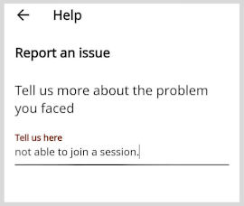

# Reporting an Issue

You can write to the support team about any problems you faced while using the application.

**To report an issue, do as follows:**

1. Go to the **Application** menu 

 and select **Help**.

2. Enter the details of the issue you faced.

    

3. Tap **Submit**. Your issue is reported successfully.