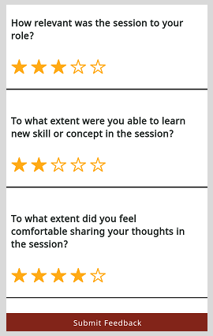

import PartialExample from './_mentored.mdx';

# Providing Session Feedback as a Mentee

At the end of the session, mentees can share feedback by providing a rating for the session. 

1. After the session, go to <PartialExample mentored />.

2. Enter the ratings and tap <b>Submit Feedback</b>. The feedback is recorded.

   

