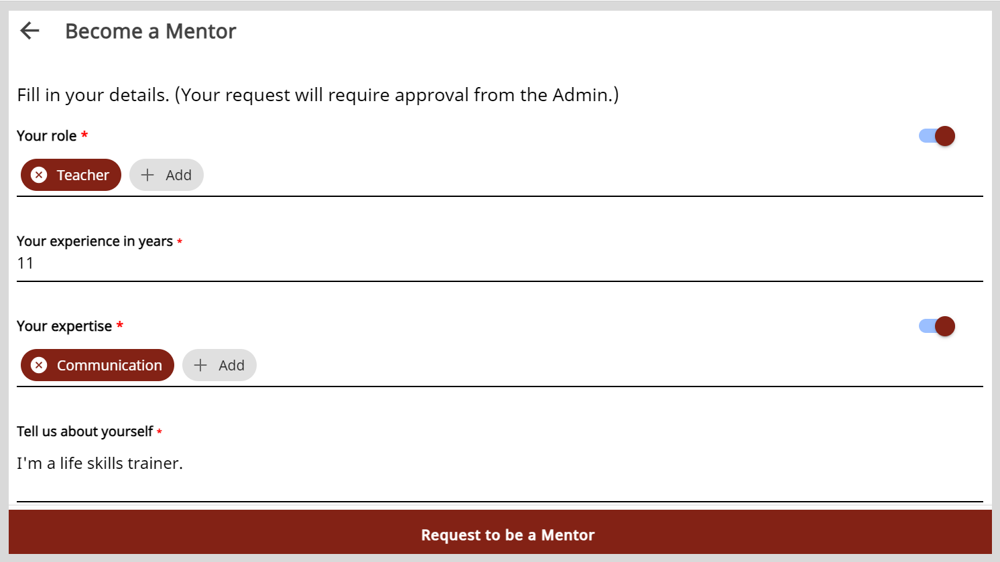

import Admonition from '@theme/Admonition';

# Requesting to become a Mentor

To become a mentor and host sessions, you can send a request to the organization administrator.

<Admonition type="note"> 

You can send a request to become a mentor only after updating your profile.

</Admonition> 

**To send a request to become a mentor, do as follows:**

1. Do one of the following actions:

    * On the Home page, click **Become a Mentor**.
    * Go to **Profile** and click **Become a Mentor**.

        <Admonition type="info">
        
To learn more about viewing your profile, see <a href="creating-and-managing-mentee-profile">Creating and Managing a Mentee Profile</a>.

        </Admonition>

2. On the Become a Mentor page, verify your profile details and edit the information if required.

    

3. Click **Request to be a Mentor**.

    <Admonition type="tip">
    
You will receive an email notification after the organization administrator reviews and approves the request.

    </Admonition>