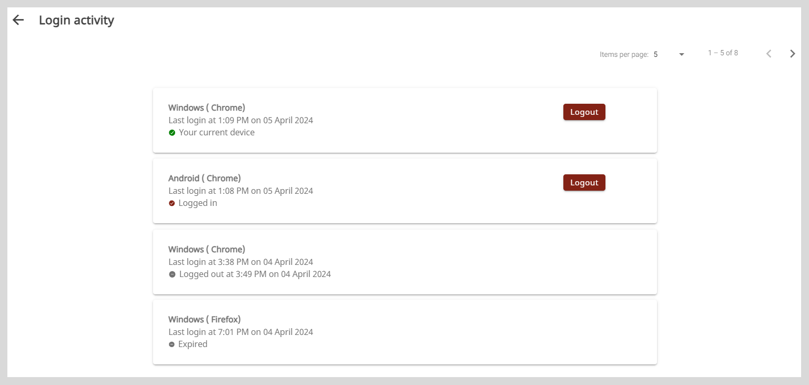

import Admonition from '@theme/Admonition';
import BurgerMenu from './media/burgermenu-icon.png'

# Viewing the Account Login Activity

On the Login activity page, you can view the following:

* The devices from which you have logged in to your account.
* The browsers on your device from which you logged in to your account. 
* The details of your login activity such as:
    * The last login time.
    * The device or browser from which:
        * You are currently accessing your account.
        * You have logged out of your account.
        * Your login session has expired.

To access the Login activity page, do one of the following actions:

  * Select <b>Login activity</b> from the <b>Application</b> menu.
  * Go to the <b>Application</b> menu  and select <b>Login activity</b>.

## Logging out

On the Login activity page, if you notice a device or a browser that is unfamiliar or not in use, you can click **Logout**. 

<Admonition type="tip">

You can change the number of devices or browsers listed on the page using the <b>Items per page</b> dropdown.

</Admonition>

