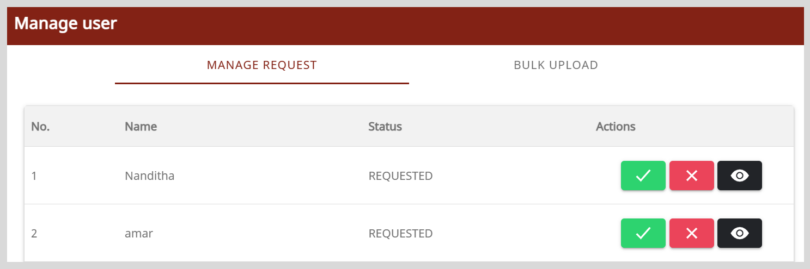

# Managing Requests to Become a Mentor

After mentees raise a request to become a mentor, the organization administrator can review their profile details and accept or reject the request.

**To accept requests to become a mentor, do as follows:**

1. Do one of the following actions:
    * Select **Workspace** from the **Application** menu.
    * Go to the **Application** menu  and select **Workspace**.

2. On the Workspace page, click **Manage user**. The Manage user page appears.

    
   
4. On the Manage Request tab, do one of the following actions:

    * To review the profile details, click **View** .

    * To accept the request, do as follows:
        1. Click **Accept** .
        2. Click **Yes** in the confirmation dialog.

    * To reject the request, do as follows:
        1. Click **Reject** .
        2. Click **Yes** in the confirmation dialog.

